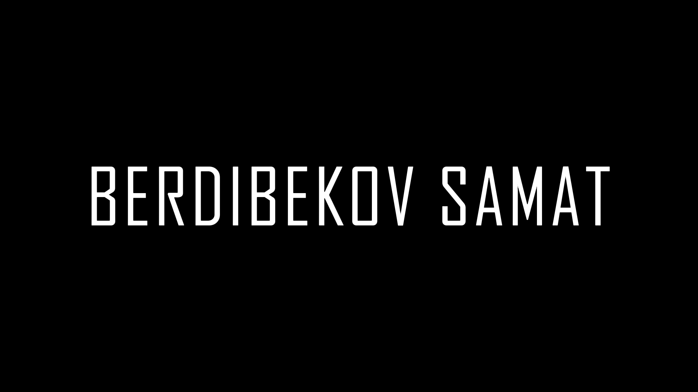

# Hello

## My name is Samat

### I am Junior Frontend Developer

---

- learning React - TypeScript
- I will be happy for good advice
- Working on a [project](https://githubcomxxadikklast_haclathon)

---

## Connect with me:

## Languages and Tools:

